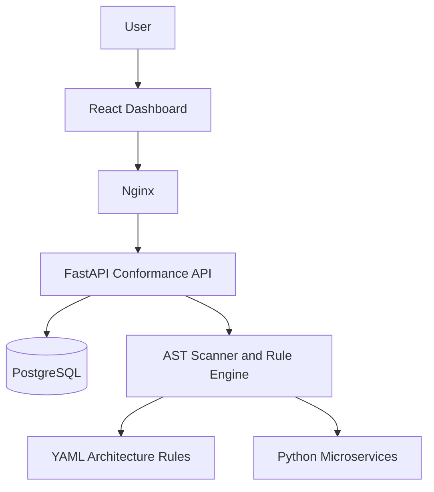
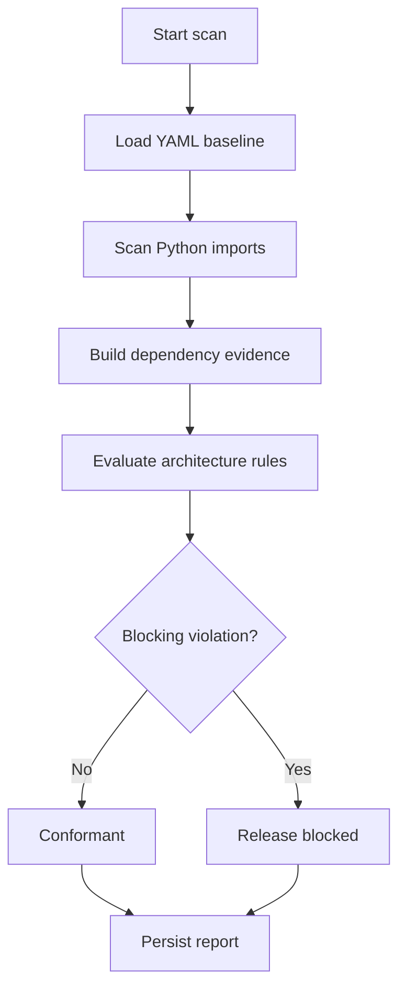

# Architecture Conformance Monitor

A full-stack platform that continuously scans Python microservices, validates their dependencies against declared architecture rules, detects architectural violations, and preserves scan evidence for auditing and technical-debt monitoring.

## Problem Statement

As software systems grow, developers may introduce dependencies that violate the intended architecture—for example, an API layer directly importing a repository layer when that relationship is forbidden.

These violations are difficult to detect during manual code reviews and gradually create:

- Tight coupling
- Unclear service boundaries
- Higher maintenance costs
- Increased technical debt
- Riskier releases
- Architecture documentation that no longer matches the code

## Proposed Solution

Architecture Conformance Monitor automates architecture validation.

The platform:

1. Loads architecture rules from YAML.
2. Statically scans Python microservices using the Python AST.
3. Detects internal layer dependencies.
4. Evaluates dependencies against the configured rules.
5. Marks scans as conformant or blocked.
6. Stores scan results and violation evidence in PostgreSQL.
7. Displays metrics, trends, history, and evidence in a React dashboard.
8. Runs the same checks automatically through GitHub Actions.

## MVP Features

- YAML-based architecture rules
- Strict rule-file validation
- Python AST dependency scanner
- Architectural layer violation detection
- Three sample FastAPI microservices
- Command-line conformance scanner
- REST API for running and retrieving scans
- PostgreSQL scan-history persistence
- Persisted violation evidence
- Conformance and blocked-release status
- React monitoring dashboard
- Historical findings trend
- Expandable scan evidence panel
- Dockerized development and production environments
- Automated Ruff, test, scan, and dashboard-build checks
- GitHub Actions continuous integration

## Technology Stack

| Area | Technology |
|---|---|
| Backend | Python 3.12, FastAPI |
| Validation | Pydantic |
| Static analysis | Python AST |
| Database | PostgreSQL 18 |
| ORM | SQLAlchemy |
| Frontend | React, TypeScript, Vite |
| Charts | Recharts |
| Icons | Lucide React |
| Web server | Nginx |
| Containers | Docker, Docker Compose |
| Testing | Pytest |
| Code quality | Ruff |
| CI | GitHub Actions |

## System Architecture



### Main Components

- **Dashboard:** Displays the latest result, metrics, trends, scan history, and violation evidence.
- **Nginx:** Serves the production frontend and proxies API requests.
- **Conformance API:** Runs scans and exposes stored results.
- **Scanner:** Inspects Python imports without executing application code.
- **Rule engine:** Compares discovered dependencies with the architecture baseline.
- **Debt tracker:** Stores scans and violation evidence in PostgreSQL.
- **Sample services:** Provide a realistic microservice system for demonstrating the scanner.

## Project Structure

```text
architecture-conformance-monitor/
├── .github/
│   └── workflows/
│       └── architecture-ci.yml
├── apps/
│   ├── inventory-service/
│   ├── order-service/
│   └── payment-service/
├── architecture-rules/
│   └── baseline.yml
├── conformance_platform/
│   ├── api/
│   ├── debt_tracker/
│   ├── rule_engine/
│   ├── scanner/
│   └── cli.py
├── dashboard/
│   ├── src/
│   ├── Dockerfile
│   └── nginx.conf
├── docker/
│   ├── platform.Dockerfile
│   └── service.Dockerfile
├── docs/
├── reports/
├── tests/
├── docker-compose.yml
├── requirements.txt
└── README.md
```

## Quick Start with Docker

### Prerequisites

Install:

- Git
- Docker Desktop
- Docker Compose

### 1. Clone the repository

```powershell
git clone https://github.com/axion-5025/architecture-conformance-monitor.git
cd architecture-conformance-monitor
```

### 2. Start the complete platform

```powershell
docker compose up -d --build
```

### 3. Check container status

```powershell
docker compose ps
```

Wait until the services report a healthy status.

### 4. Open the application

| Component | URL |
|---|---|
| Production dashboard | http://localhost:8088 |
| API documentation | http://localhost:8000/docs |
| API health check | http://localhost:8000/health |
| API through Nginx | http://localhost:8088/health |
| Order service | http://localhost:8001/docs |
| Payment service | http://localhost:8002/docs |
| Inventory service | http://localhost:8003/docs |
| PostgreSQL | `localhost:5432` |

### 5. Stop the platform

```powershell
docker compose down
```

To remove the PostgreSQL volume as well:

```powershell
docker compose down -v
```

> Warning: `docker compose down -v` permanently removes the locally stored scan history and violation evidence.

## Running Locally for Development

### Backend

Create and activate a virtual environment:

```powershell
python -m venv venv
.\venv\Scripts\Activate.ps1
```

Install dependencies:

```powershell
python -m pip install --upgrade pip
python -m pip install -r requirements.txt
```

Start PostgreSQL:

```powershell
docker compose up -d postgres
```

Start the conformance API:

```powershell
python -m uvicorn conformance_platform.api.main:app --reload --port 8000
```

### Frontend

Open a second terminal:

```powershell
cd C:\architecture-conformance-monitor\dashboard
npm ci
npm run dev
```

Open:

```text
http://localhost:5173
```

The development dashboard communicates with the API running on port `8000`.

## Architecture Rules

The baseline is defined in:

```text
architecture-rules/baseline.yml
```

The rule file declares:

- Application information
- Registered services
- Source locations
- Recognized layers
- Allowed and forbidden dependencies
- Rule severity
- Database-ownership constraints

The rule loader rejects malformed configurations, unknown fields, unknown services, and invalid ownership declarations before scanning begins.

## How a Scan Works



The scanner uses the Python Abstract Syntax Tree rather than simple text matching. This allows it to identify imports, their source files, line numbers, source layers, target layers, and target modules.

## Using the Dashboard

1. Open `http://localhost:8088`.
2. Select **Run scan**.
3. Review the summary metrics.
4. Check the conformance status.
5. Review the findings trend.
6. Select a row in **Scan history**.
7. Inspect persisted evidence for that scan.

A conformant scan displays a green status. A scan containing a blocking violation displays a red **Blocked** status and evidence including:

- Violation type
- Severity
- Service
- Source file and line
- Source layer
- Target layer
- Target module
- Evidence type
- Violation ID

## REST API

| Method | Endpoint | Description |
|---|---|---|
| `GET` | `/health` | Check API health |
| `POST` | `/api/v1/scans` | Run and persist a new scan |
| `GET` | `/api/v1/scans/latest` | Retrieve the latest persisted scan |
| `GET` | `/api/v1/scans/history` | Retrieve scan-history summaries |
| `GET` | `/api/v1/scans/{scan_id}` | Retrieve one scan with violation evidence |

Interactive documentation is available at:

```text
http://localhost:8000/docs
```

## Command-Line Scanner

Activate the Python environment and run:

```powershell
python -m conformance_platform.cli
```

Generate a report at a specific location:

```powershell
python -m conformance_platform.cli --output reports/conformance-report.json
```

Exit codes:

| Code | Meaning |
|---|---|
| `0` | Scan completed without blocking violations |
| `1` | One or more blocking violations were detected |

This behavior allows the scanner to block a CI pipeline when the architecture is violated.

## Testing and Code Quality

Activate the virtual environment before running the checks.

### Run Ruff

```powershell
python -m ruff check conformance_platform tests
```

### Run all backend tests

```powershell
python -m pytest -v
```

### Build the frontend

```powershell
cd dashboard
npm ci
npm run build
```

The current backend suite covers:

- Rule loading and validation
- Static dependency scanning
- Invalid Python handling
- Layer-violation evaluation
- CLI exit behavior
- Scan persistence
- Violation persistence
- Scan-history retrieval
- Scan-detail retrieval
- REST API behavior

## Continuous Integration

The GitHub Actions workflow is located at:

```text
.github/workflows/architecture-ci.yml
```

It runs automatically for pushes and pull requests targeting `main`.

The pipeline performs:

1. Python dependency installation
2. Ruff code-quality checks
3. Backend test execution
4. Architecture conformance scanning
5. Conformance-report artifact upload
6. Frontend dependency installation
7. Production dashboard build

A failed quality check, test, frontend build, or blocking architecture violation prevents the workflow from succeeding.

## Deployment

The application is containerized and can be deployed to any platform supporting Docker containers.

Recommended deployment targets include:

| Component | Deployment options |
|---|---|
| React/Nginx dashboard | Render, Railway, Fly.io, AWS ECS, Azure Container Apps |
| FastAPI backend | Render, Railway, Fly.io, AWS ECS, Azure Container Apps |
| PostgreSQL | Managed PostgreSQL from Render, Railway, AWS RDS, Azure Database |
| Complete Docker Compose stack | Linux VM, AWS EC2, Azure VM, DigitalOcean |

For production:

- Replace default database credentials.
- Configure environment variables securely.
- Use HTTPS and a reverse proxy or load balancer.
- Restrict database network access.
- Configure database backups.
- Use an explicit dashboard port or domain.
- Add authentication before exposing scan operations publicly.

## Software Engineering Value

This project demonstrates:

- Requirements-driven development
- Modular architecture
- Separation of concerns
- Static program analysis
- Configuration-driven rule enforcement
- REST API design
- Database modelling and persistence
- Automated testing
- Continuous integration
- Containerization
- Full-stack integration
- Auditable technical-debt monitoring

## MVP Scope

The MVP supports Python services and layer-level import rules. It proves that architecture constraints can be converted into executable checks and enforced locally, through an API, from a dashboard, and inside CI.

## Future Enhancements

- Git repository scanning by URL and commit
- Support for Java, JavaScript, and TypeScript
- User authentication and role-based access
- Multiple projects and rule sets
- GitHub pull-request annotations
- Violation suppression with expiry dates
- Technical-debt ownership and assignment
- Notifications through email or team messaging
- OpenTelemetry tracing and Jaeger visualization
- Scheduled scans
- Exportable PDF and CSV reports
- Advanced dependency-graph visualization

## Repository

[axion-5025/architecture-conformance-monitor](https://github.com/axion-5025/architecture-conformance-monitor)

## License

This repository was developed as a Software Engineering academic project. Add an appropriate open-source license before external distribution.