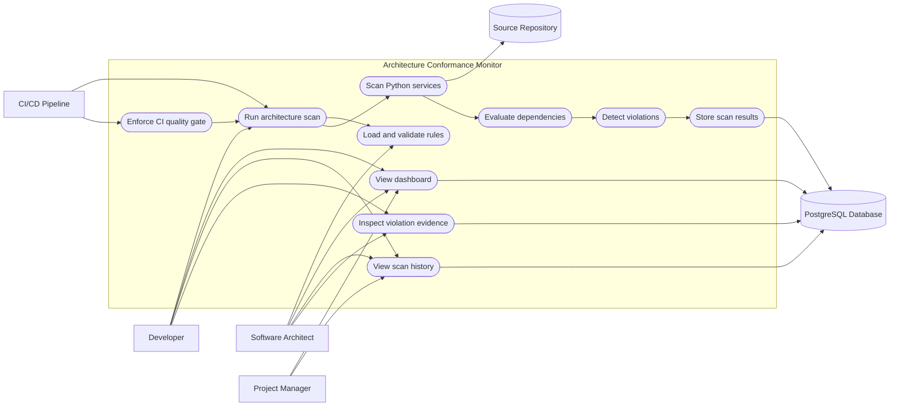

# Use-Case Diagram

## Architecture Conformance Monitor

## 1. Purpose

This document describes how the external actors interact with the Architecture Conformance Monitor. The system scans Python microservices, evaluates architectural rules, stores results, displays historical evidence, and enforces architecture checks through CI.

## 2. Actors

| Actor | Description |
|---|---|
| Developer | Runs scans, reviews results, fixes violations, and views scan evidence. |
| Software Architect | Defines architecture rules and reviews system conformance. |
| Project Manager | Reviews conformance status, trends, and technical-debt history. |
| CI/CD Pipeline | Automatically executes quality tests and architecture scans. |
| PostgreSQL Database | Stores scan summaries and violation evidence. |
| Source Repository | Contains Python microservices and architecture rule files. |

## 3. Use-Case Diagram

## 4. Use-Case Relationships

The primary use case is **Run architecture scan**. It includes the following operations:

1. Load and validate the YAML architecture rules.
2. Scan the registered Python microservices.
3. identify internal layer dependencies.
4. Evaluate the detected dependencies against the approved rules.
5. Detect architectural violations.
6. Generate and persist the scan results.

The dashboard-related use cases retrieve previously persisted information:

- View dashboard
- View scan history
- Inspect violation evidence

The CI/CD pipeline automatically invokes the scan and uses its exit status to determine whether the architecture quality gate passes or fails.

## 5. Detailed Use Cases

### UC-01: Run Architecture Scan

| Field | Description |
|---|---|
| Primary actors | Developer, CI/CD Pipeline |
| Preconditions | Architecture rules and service source directories are available. |
| Trigger | The user selects **Run scan**, runs the CLI, or starts the CI workflow. |
| Main flow | The system loads the rules, scans the services, evaluates dependencies, detects violations, generates a report, and stores the result. |
| Alternative flow | If the rule file or Python source is invalid, the scan stops and reports an error. |
| Postconditions | A scan report is generated and persisted. |
| Output | Scan identifier, summary, blocking status, services, dependencies, and violations. |

### UC-02: Manage Architecture Rules

| Field | Description |
|---|---|
| Primary actor | Software Architect |
| Preconditions | The actor has access to the repository. |
| Trigger | The architect creates or updates the YAML baseline. |
| Main flow | The architect defines services, layers, allowed dependencies, and forbidden dependencies. |
| Alternative flow | An invalid or unknown field causes strict rule validation to fail. |
| Postconditions | A validated architecture baseline becomes available for future scans. |

### UC-03: View Dashboard

| Field | Description |
|---|---|
| Primary actors | Developer, Software Architect, Project Manager |
| Preconditions | The API and dashboard are running. |
| Trigger | The actor opens the Architecture Guard dashboard. |
| Main flow | The dashboard retrieves the latest scan and history and displays metrics, status, trends, and audit data. |
| Alternative flow | If no scan exists, the dashboard displays a no-scan state. |
| Postconditions | The actor can understand the current architecture condition. |

### UC-04: View Scan History

| Field | Description |
|---|---|
| Primary actors | Developer, Software Architect, Project Manager |
| Preconditions | At least one scan has been stored. |
| Trigger | The actor opens the scan-history section. |
| Main flow | The system retrieves scans in descending chronological order. |
| Postconditions | The actor can compare previous conformant and blocked scans. |

### UC-05: Inspect Violation Evidence

| Field | Description |
|---|---|
| Primary actors | Developer, Software Architect |
| Preconditions | The selected scan exists. |
| Trigger | The actor selects a scan-history row. |
| Main flow | The system retrieves the persisted scan and displays its violation evidence. |
| Alternative flow | A conformant scan displays that no violations were recorded. |
| Postconditions | The actor can identify the affected service, file, line, source layer, target layer, module, severity, and evidence type. |

### UC-06: Enforce Architecture Quality Gate

| Field | Description |
|---|---|
| Primary actor | CI/CD Pipeline |
| Preconditions | The repository contains the workflow and all required dependencies. |
| Trigger | Code is pushed to `main` or a pull request targets `main`. |
| Main flow | CI installs dependencies, runs Ruff, executes tests, builds the dashboard, and performs the conformance scan. |
| Alternative flow | Any failed quality check or blocking violation causes the job to fail. |
| Postconditions | Non-conformant changes are visibly blocked by the automated workflow. |

## 6. Actor-to-Use-Case Matrix

| Use case | Developer | Architect | Manager | CI/CD |
|---|:---:|:---:|:---:|:---:|
| Run architecture scan | Yes | Yes | No | Yes |
| Manage architecture rules | No | Yes | No | No |
| View dashboard | Yes | Yes | Yes | No |
| View scan history | Yes | Yes | Yes | No |
| Inspect violation evidence | Yes | Yes | Optional | No |
| Enforce quality gate | No | No | No | Yes |

## 7. Expected Outcomes

The use cases ensure that the system:

- Detects architecture violations before they accumulate as technical debt.
- Gives developers actionable evidence for correcting violations.
- Gives architects control over the approved dependency rules.
- Gives managers a concise view of architectural health and historical trends.
- Prevents non-conformant changes from silently entering the main branch.
- Maintains an auditable record of conformant and blocked scans.