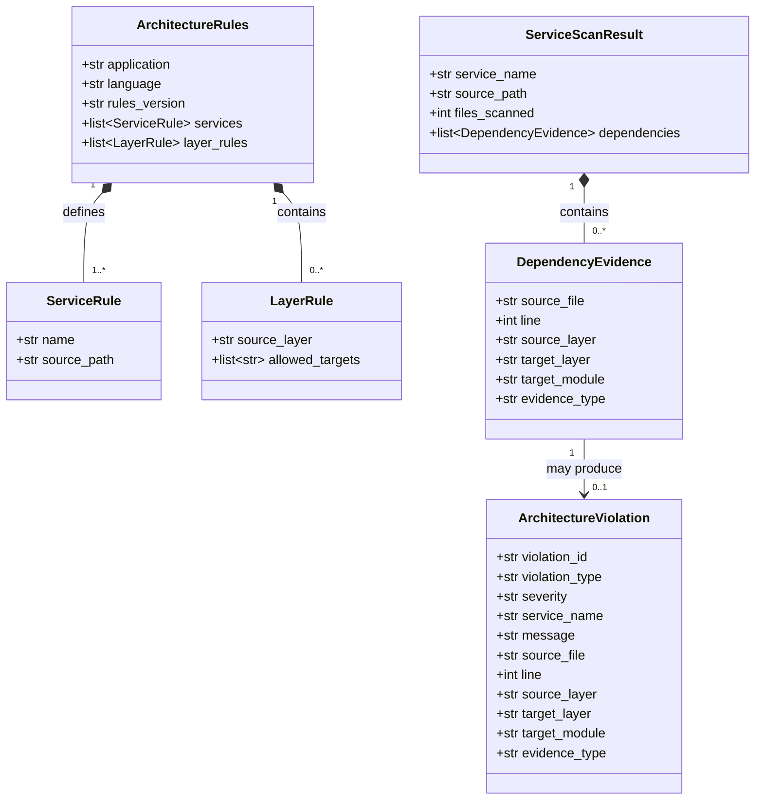
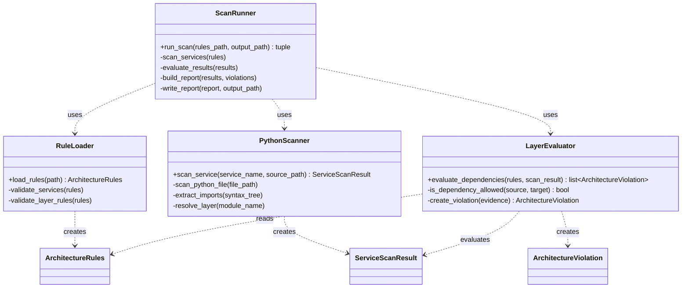
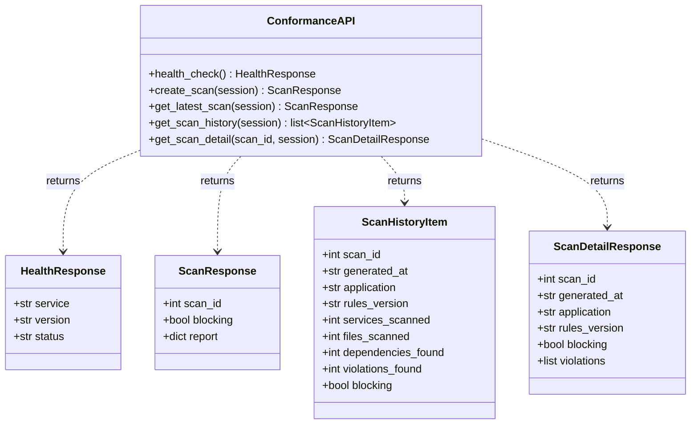
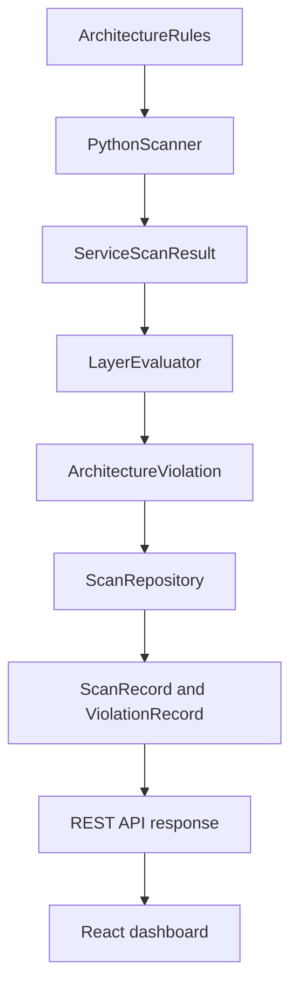

# Class Diagram

## Architecture Conformance Monitor

## 1. Purpose

This document presents the class-level design of the Architecture Conformance Monitor.

The diagram describes the main data models and responsibilities used for:

- Loading architecture rules.
- Scanning Python microservices.
- Detecting dependencies.
- Evaluating architecture violations.
- Persisting scan results.
- Exposing scan information through the REST API.
- Displaying scan results in the dashboard.

Some implementation modules use Python functions instead of classes. For UML clarity, these modules are represented as conceptual service classes based on their actual responsibilities.

---

## 2. Core Domain Class Diagram

---

## 3. Processing Service Class Diagram

---

## 4. Persistence Class Diagram

```mermaid
classDiagram
direction TB

class ScanRecord {
    +int id
    +datetime generated_at
    +str application
    +str rules_version
    +int services_scanned
    +int files_scanned
    +int dependencies_found
    +int violations_found
    +bool blocking
    +list~ViolationRecord~ violations
}

class ViolationRecord {
    +int id
    +int scan_id
    +str violation_id
    +str violation_type
    +str severity
    +str service_name
    +str message
    +str source_file
    +int line
    +str source_layer
    +str target_layer
    +str target_module
    +str evidence_type
}

class ScanRepository {
    +save_scan_report(session, report, blocking) ScanRecord
    +get_latest_scan(session) ScanRecord
    +get_scan_by_id(session, scan_id) ScanRecord
    +list_scans(session, limit) list~ScanRecord~
}

class DatabaseManager {
    +create_tables()
    +get_session() Session
    +create_engine()
}

ScanRecord "1" *-- "0..*" ViolationRecord : owns
ScanRepository ..> ScanRecord : manages
ScanRepository ..> ViolationRecord : manages
ScanRepository ..> DatabaseManager : uses
```

---

## 5. API Data Transfer Class Diagram

---

## 6. Class Responsibilities

| Class or module | Responsibility |
|---|---|
| `ArchitectureRules` | Represents the validated architecture baseline loaded from YAML. |
| `ServiceRule` | Defines a registered microservice and its source-code location. |
| `LayerRule` | Defines allowed or forbidden dependencies between architecture layers. |
| `DependencyEvidence` | Stores evidence of an internal dependency found in Python source code. |
| `ServiceScanResult` | Stores the result of scanning one microservice. |
| `ArchitectureViolation` | Represents a dependency that violates an architecture rule. |
| `RuleLoader` | Loads and validates the architecture baseline. |
| `PythonScanner` | Parses Python files using AST and extracts internal dependencies. |
| `LayerEvaluator` | Compares detected dependencies with configured architecture rules. |
| `ScanRunner` | Coordinates the complete end-to-end conformance scan. |
| `ScanRecord` | Stores the summary and status of a scan in the database. |
| `ViolationRecord` | Stores detailed evidence for one detected violation. |
| `ScanRepository` | Saves and retrieves persisted scans and violation evidence. |
| `DatabaseManager` | Creates database tables and provides SQLAlchemy sessions. |
| `ConformanceAPI` | Exposes health, scan, history, latest-scan, and scan-detail endpoints. |
| `ScanResponse` | Transfers the complete result of a newly executed scan. |
| `ScanHistoryItem` | Transfers summary information used by the dashboard history table. |
| `ScanDetailResponse` | Transfers persisted evidence for a selected scan. |

---

## 7. Important Relationships

### 7.1 Composition

A `ScanRecord` owns zero or more `ViolationRecord` objects.

When a scan is deleted, its associated violation records are also removed through the configured cascade relationship.

### 7.2 Rule ownership

`ArchitectureRules` contains service definitions and layer dependency rules. These rules form the approved architecture baseline.

### 7.3 Scanner output

`PythonScanner` produces a `ServiceScanResult`. Each result contains zero or more `DependencyEvidence` records.

### 7.4 Violation generation

`LayerEvaluator` evaluates every discovered dependency. A forbidden dependency produces an `ArchitectureViolation`.

### 7.5 Persistence

`ScanRepository` converts the generated report into:

- One `ScanRecord`.
- Zero or more associated `ViolationRecord` objects.

### 7.6 API presentation

The REST API converts persisted records into response models consumed by the React dashboard.

---

## 8. End-to-End Object Interaction

The end-to-end interaction is:

1. The baseline YAML file is loaded into `ArchitectureRules`.
2. `PythonScanner` scans each registered service.
3. Each scan produces a `ServiceScanResult`.
4. `LayerEvaluator` checks detected dependencies against the rules.
5. Forbidden dependencies become `ArchitectureViolation` objects.
6. `ScanRepository` saves the scan summary and evidence.
7. The REST API retrieves the persisted data.
8. The React dashboard displays scan history and violation evidence.

---

## 9. Design Principles

The class design follows these software-engineering principles:

- **Single Responsibility Principle:** Each class or module has one main responsibility.
- **Separation of Concerns:** Scanning, evaluation, persistence, API delivery, and presentation are separated.
- **Dependency Inversion:** API endpoints depend on repository abstractions and database sessions.
- **Encapsulation:** Database logic is isolated inside the debt-tracker package.
- **Traceability:** Each violation retains its service, source file, line number, layer relationship, and evidence type.
- **Extensibility:** Additional scanners and architecture-rule types can be added without redesigning the complete platform.
- **Testability:** Scanner, evaluator, repository, CLI, and API behavior can be tested independently.

---

## 10. Summary

The class design separates the Architecture Conformance Monitor into five main areas:

1. Architecture-rule models.
2. Static dependency scanning.
3. Architecture-rule evaluation.
4. Scan and violation persistence.
5. REST API and dashboard presentation.

This separation makes the system maintainable, testable, auditable, and suitable for continuous architecture enforcement.