# Sequence Diagrams

## Architecture Conformance Monitor

**Document Type:** UML Sequence Diagram Specification  
**Project:** Architecture Conformance Monitor  
**Version:** 1.0

---

## 1. Purpose

This document describes the time-ordered interactions between users, frontend components, backend services, the architecture scanning engine, and the PostgreSQL database.

The diagrams cover the following major workflows:

1. Loading the monitoring dashboard
2. Running an architecture conformance scan
3. Viewing scan history and violation evidence
4. Executing automated conformance checks through GitHub Actions

---

## 2. System Participants

| Participant | Responsibility |
|---|---|
| Developer | Uses the dashboard and initiates scans |
| React Dashboard | Displays metrics, scan status, trends, history, and evidence |
| FastAPI Backend | Exposes REST endpoints and coordinates scan operations |
| Scan Runner | Executes the end-to-end architecture scan |
| Rule Loader | Loads and validates the YAML architecture baseline |
| Python Scanner | Statically analyzes Python source files |
| Layer Evaluator | Detects prohibited architectural dependencies |
| Scan Repository | Persists and retrieves scan records |
| PostgreSQL | Stores scan summaries and violation evidence |
| GitHub Actions | Executes automated quality and conformance checks |

---

## 3. Dashboard Loading Sequence

### 3.1 Description

When the developer opens the dashboard, the React application requests the latest scan and the scan-history list.

The backend retrieves these records from PostgreSQL and returns them to the dashboard. If no scan exists, the dashboard displays its empty state.

### 3.2 Sequence Diagram

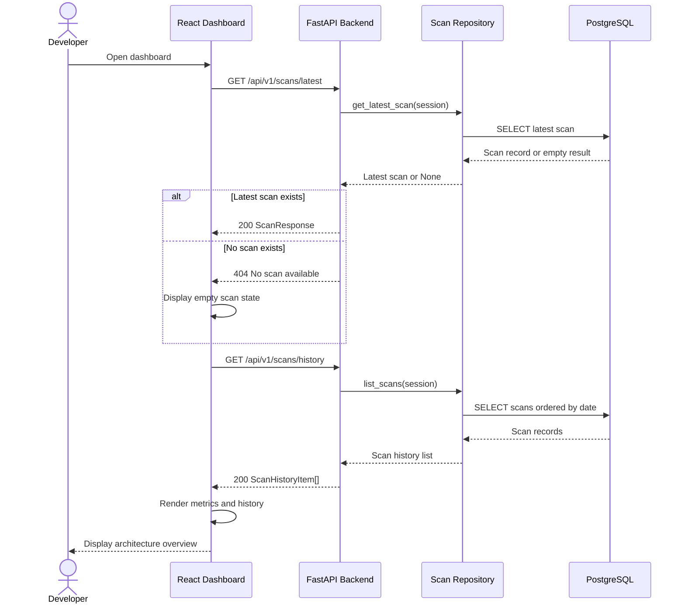

### 3.3 Result

The dashboard displays:

- Latest architecture status
- Services scanned
- Files scanned
- Dependencies detected
- Violations detected
- Findings trend
- Historical scan records

---

## 4. Architecture Scan Execution Sequence

### 4.1 Description

The developer selects **Run scan** from the dashboard.

The backend invokes the scan runner, which loads the YAML rules, scans each registered Python microservice, evaluates dependencies, generates a report, and saves the result in PostgreSQL.

### 4.2 Scan Request and Coordination

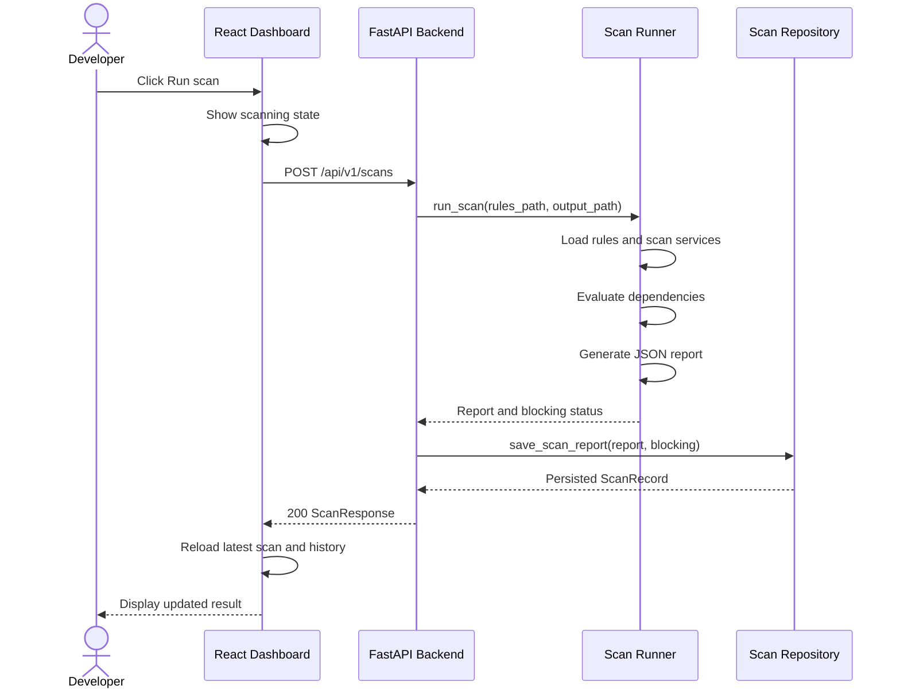

### 4.3 Internal Scan Processing

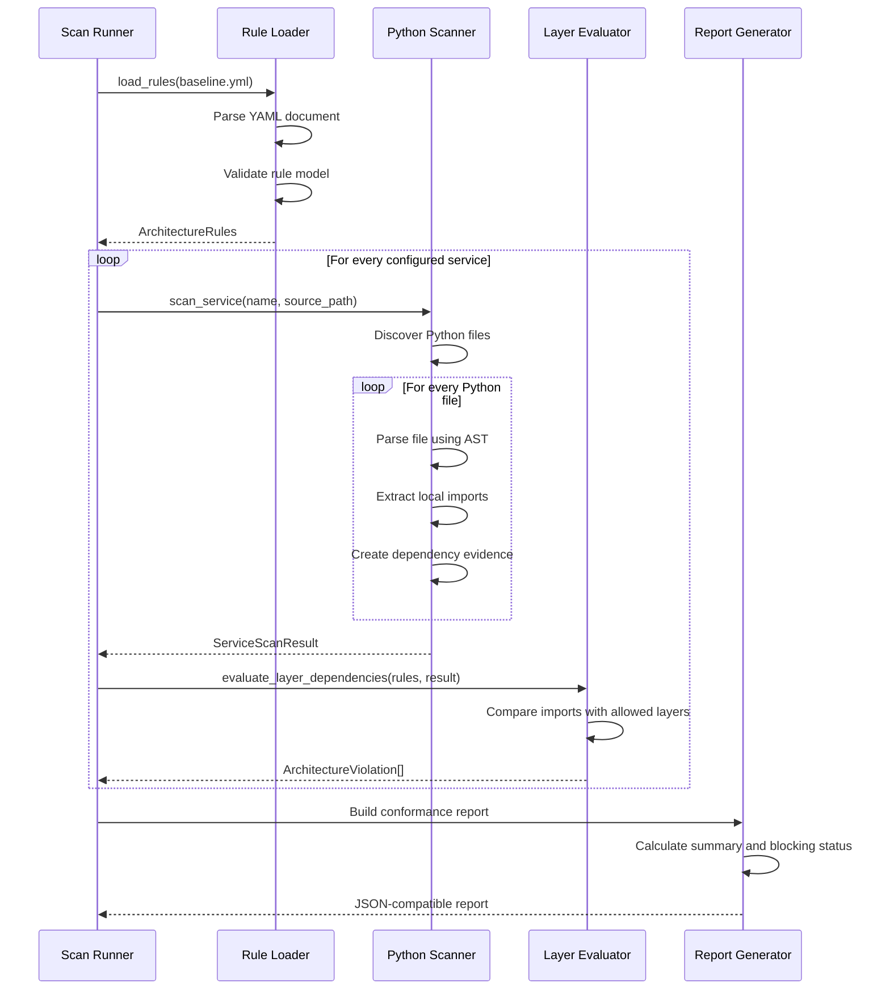

### 4.4 Alternative Outcomes

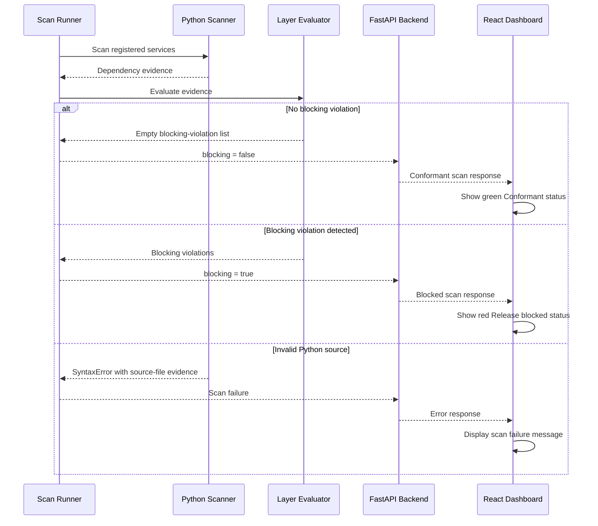

---

## 5. Scan Persistence Sequence

### 5.1 Description

Every completed scan is preserved as an auditable database record.

The scan summary is stored in `scan_records`, while individual violations are stored in `violation_records`.

### 5.2 Sequence Diagram

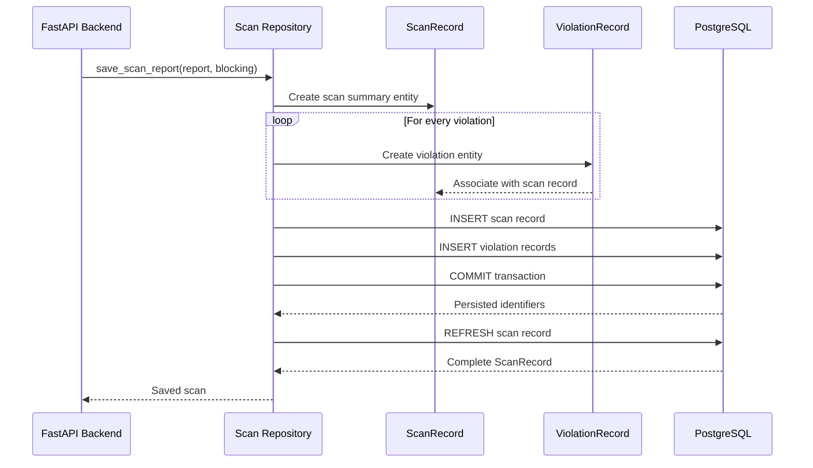

### 5.3 Transaction Behaviour

If persistence succeeds:

- The scan receives a unique identifier.
- All violation records reference the scan identifier.
- The transaction is committed.
- The API returns the persisted scan identifier.

If persistence fails:

- The transaction is not treated as successful.
- The API does not return a valid scan result.
- The dashboard displays an error state.

---

## 6. Scan History and Evidence Sequence

### 6.1 Description

The developer can select any historical scan from the audit-trail table.

The dashboard requests the complete persisted scan detail. The backend retrieves the scan record and its associated violations from PostgreSQL.

### 6.2 Sequence Diagram

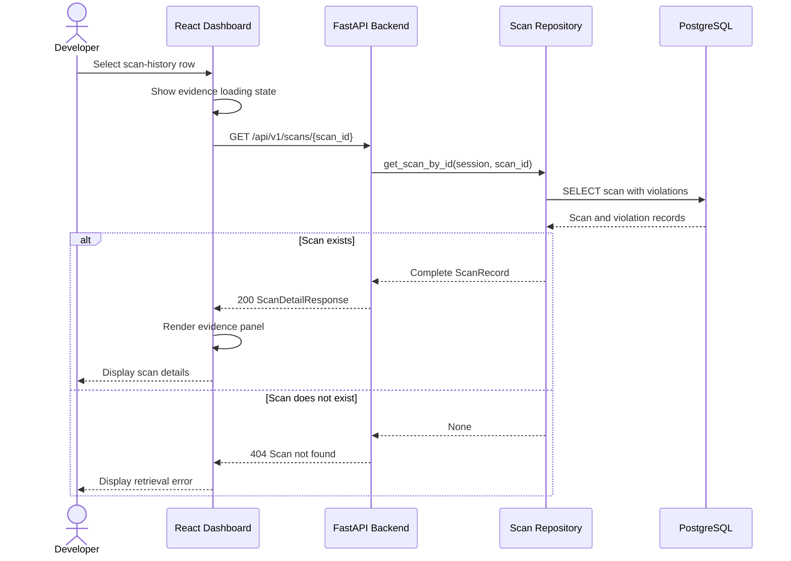

### 6.3 Conformant Evidence Panel

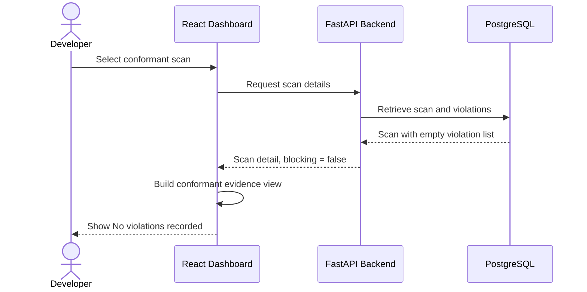

### 6.4 Blocked Evidence Panel

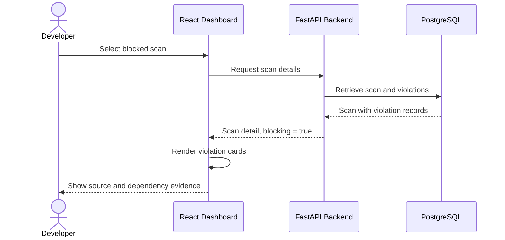

### 6.5 Evidence Displayed

For a blocked scan, the dashboard displays:

- Violation type
- Severity
- Service name
- Human-readable message
- Source file
- Line number
- Source layer
- Target layer
- Target module
- Evidence type
- Unique violation identifier

---

## 7. GitHub Actions CI Sequence

### 7.1 Description

Every push or pull request targeting the `main` branch starts the Architecture CI workflow.

The workflow validates backend quality, automated tests, dashboard compilation, and architecture conformance.

### 7.2 Sequence Diagram

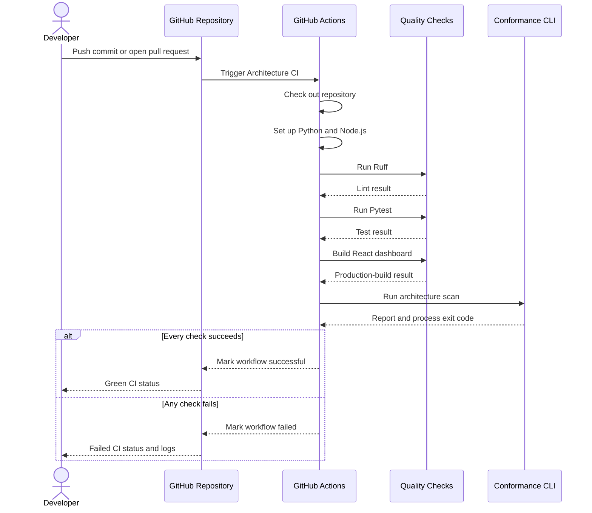

### 7.3 CI Quality Gates

| Gate | Command | Failure Condition |
|---|---|---|
| Python linting | `python -m ruff check conformance_platform tests` | Style or quality violation |
| Backend testing | `python -m pytest -v` | One or more failed tests |
| Dashboard build | `npm run build` | TypeScript or Vite build error |
| Architecture scan | `python -m conformance_platform.cli` | Blocking architecture violation |

---

## 8. Health Monitoring Sequence

### 8.1 Description

Docker Compose periodically checks whether the backend and sample services are operational.

### 8.2 Sequence Diagram

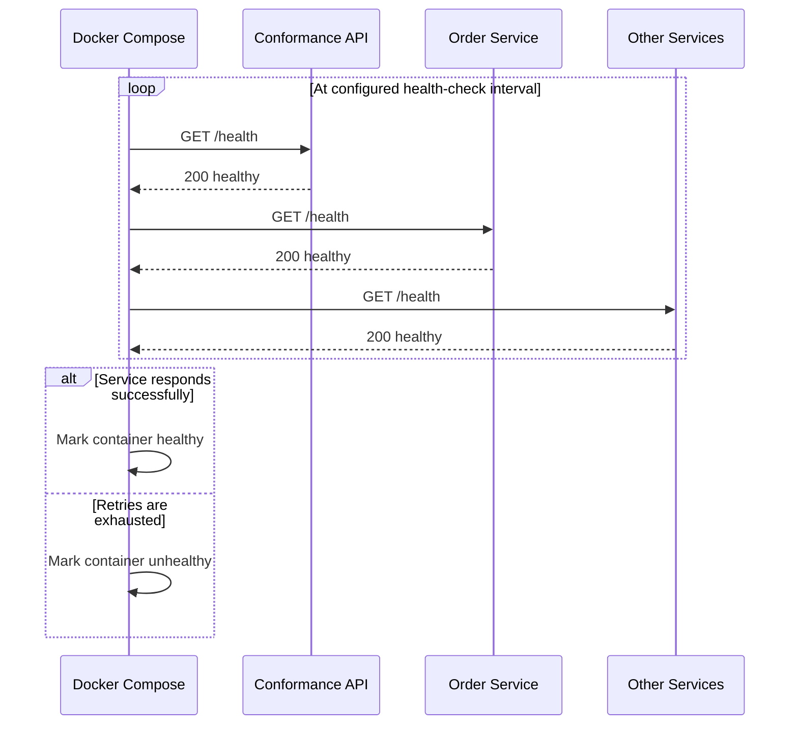

---

## 9. End-to-End Interaction Summary

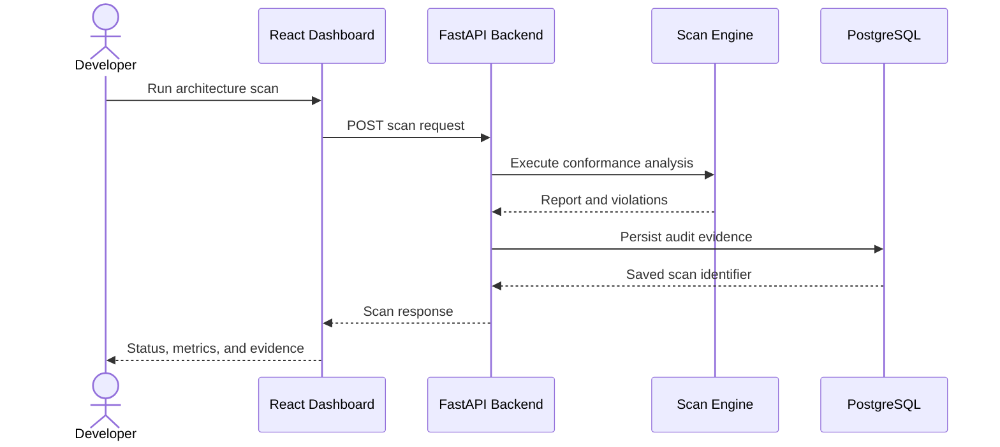

---

## 10. Preconditions and Postconditions

### 10.1 Run-Scan Use Case

**Preconditions**

- FastAPI backend is running.
- PostgreSQL is available.
- Architecture baseline file exists.
- Registered service directories are accessible.
- Python source files are available for analysis.

**Postconditions**

- Source files have been statically scanned.
- Dependency evidence has been evaluated.
- A conformance report has been generated.
- Scan summary and violations have been persisted.
- Updated results are available through the dashboard and REST API.

### 10.2 View-Scan-Evidence Use Case

**Preconditions**

- At least one scan exists in the database.
- The selected scan identifier is valid.
- The backend is accessible from the dashboard.

**Postconditions**

- Persisted scan metadata is displayed.
- Violation evidence is shown when present.
- A conformant confirmation is shown when no violations exist.

---

## 11. Error and Exception Scenarios

| Scenario | System Response |
|---|---|
| No latest scan exists | API returns `404`; dashboard displays the empty state |
| Requested scan ID does not exist | API returns `404`; dashboard displays an error |
| Invalid Python file is scanned | Scanner raises a syntax-related scan error |
| YAML baseline is invalid | Rule loader rejects the rule file |
| Database is unavailable | Persistence or retrieval operation fails |
| Backend is unavailable | Dashboard displays a request-failure message |
| Blocking dependency is found | Scan is stored and marked as blocked |
| Dashboard build fails in CI | GitHub Actions marks the workflow as failed |

---

## 12. Traceability to Requirements

| Sequence | Related Functional Requirements |
|---|---|
| Dashboard loading | FR-09, FR-10, FR-11 |
| Architecture scan execution | FR-01, FR-02, FR-03, FR-04, FR-05 |
| Scan persistence | FR-06, FR-07 |
| Scan history and evidence | FR-08, FR-09, FR-10 |
| GitHub Actions CI | FR-12, FR-13 |
| Health monitoring | FR-14 |

---

## 13. Conclusion

The sequence diagrams demonstrate how the Architecture Conformance Monitor coordinates frontend requests, REST API operations, static source-code analysis, rule evaluation, database persistence, audit-evidence retrieval, and continuous integration.

These interactions ensure that architectural violations are detected early, stored permanently, presented with actionable evidence, and enforced automatically during development and delivery.