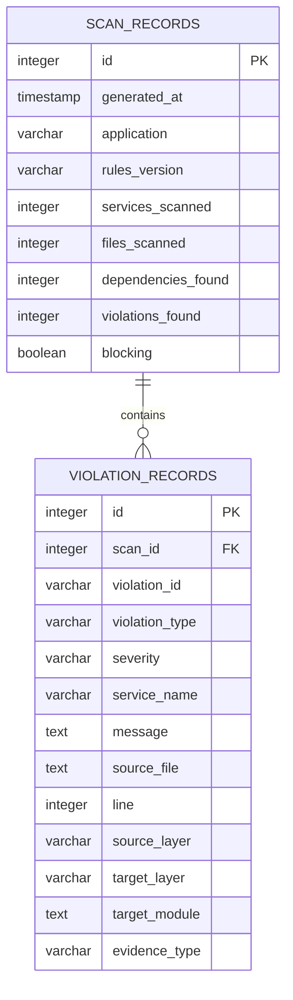
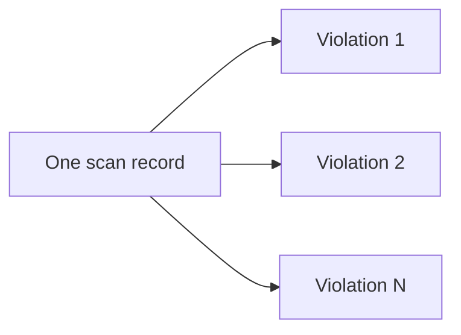
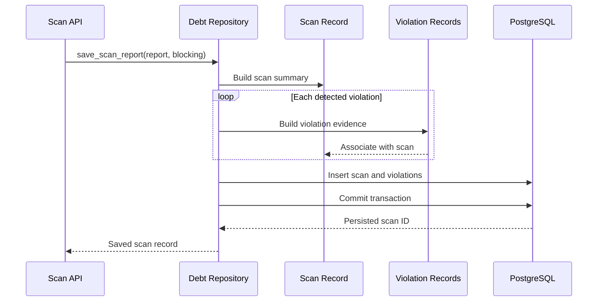
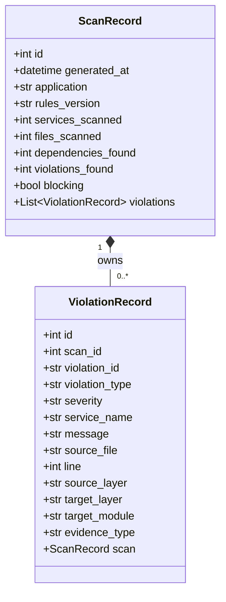

# Entity–Relationship Diagram

## Architecture Conformance Monitor

---

## 1. Purpose

This document describes the database structure of the Architecture Conformance Monitor.

The system stores every architecture scan as a permanent audit record. If a scan discovers architectural violations, those violations are stored as evidence linked to the corresponding scan.

The database currently contains two primary entities:

1. `ScanRecord`
2. `ViolationRecord`

A single scan may contain zero or more violations.

---

## 2. Database Overview

The Architecture Conformance Monitor uses PostgreSQL as its production database.

SQLAlchemy provides the object-relational mapping between Python classes and relational database tables.

The primary database tables are:

| Entity | Database table | Purpose |
|---|---|---|
| `ScanRecord` | `scan_records` | Stores the summary and status of every architecture scan |
| `ViolationRecord` | `violation_records` | Stores detailed evidence for each detected architecture violation |

---

## 3. Main ER Diagram



---

## 4. Relationship Description

The relationship between `SCAN_RECORDS` and `VIOLATION_RECORDS` is one-to-many.

```text
One ScanRecord → Zero or Many ViolationRecords
One ViolationRecord → Exactly One ScanRecord
```

A conformant scan has no violation records.

A blocked scan has one or more violation records.

| Scan condition | Scan record | Violation records |
|---|---:|---:|
| Conformant | 1 | 0 |
| Blocked | 1 | 1 or more |

---

## 5. ScanRecord Entity

### 5.1 Purpose

The `ScanRecord` entity stores the high-level result of a completed architecture conformance scan.

It provides the information required by:

- the dashboard summary;
- scan history;
- architecture trend charts;
- release status decisions;
- audit and technical-debt analysis.

### 5.2 Table Definition

Table name:

```text
scan_records
```

### 5.3 Attributes

| Attribute | Database type | Key/constraint | Description |
|---|---|---|---|
| `id` | Integer | Primary key, auto-increment | Unique identifier for the scan |
| `generated_at` | Timestamp with timezone | Required | Date and time at which the report was generated |
| `application` | Varchar(120) | Required | Name of the application that was scanned |
| `rules_version` | Varchar(30) | Required | Version of the architecture rule set |
| `services_scanned` | Integer | Required | Number of services included in the scan |
| `files_scanned` | Integer | Required | Number of Python source files inspected |
| `dependencies_found` | Integer | Required | Number of internal dependencies detected |
| `violations_found` | Integer | Required | Number of architecture violations detected |
| `blocking` | Boolean | Required | Indicates whether the scan blocks the release |

### 5.4 Primary Key

The `id` field is the primary key.

It uniquely identifies each scan and is automatically generated when a scan is saved.

Example:

```text
Scan #1
Scan #2
Scan #3
```

### 5.5 Business Rules

- Every completed scan must create one `ScanRecord`.
- A scan record must contain the applied architecture-rule version.
- Summary counts must be non-negative.
- `blocking` is `true` when blocking violations are detected.
- `blocking` is `false` when the architecture is conformant.
- The latest scan is determined using `generated_at`.
- Scan history is returned in descending generation-time order.

---

## 6. ViolationRecord Entity

### 6.1 Purpose

The `ViolationRecord` entity stores actionable evidence about one architecture-rule violation.

It allows a developer to determine:

- which service contains the violation;
- which source file caused the violation;
- the relevant line number;
- the source and target layers;
- the imported target module;
- the type and severity of the violation;
- the evidence collection method.

### 6.2 Table Definition

Table name:

```text
violation_records
```

### 6.3 Attributes

| Attribute | Database type | Key/constraint | Description |
|---|---|---|---|
| `id` | Integer | Primary key, auto-increment | Internal database identifier |
| `scan_id` | Integer | Foreign key, required, indexed | References the owning scan |
| `violation_id` | Varchar(64) | Required, indexed | Stable identifier generated for the violation |
| `violation_type` | Varchar(60) | Required | Category of architecture violation |
| `severity` | Varchar(20) | Required | Severity such as low, medium, high, or critical |
| `service_name` | Varchar(120) | Required | Service in which the violation was detected |
| `message` | Text | Required | Human-readable violation explanation |
| `source_file` | Text | Required | Path of the source file containing the dependency |
| `line` | Integer | Required | Source-code line on which the dependency occurs |
| `source_layer` | Varchar(60) | Required | Architectural layer that initiates the dependency |
| `target_layer` | Varchar(60) | Required | Architectural layer being referenced |
| `target_module` | Text | Required | Imported Python module that caused the finding |
| `evidence_type` | Varchar(30) | Required | Method used to obtain evidence, such as static analysis |

### 6.4 Primary Key

The `id` field is the database primary key.

### 6.5 Foreign Key

The `scan_id` field references:

```text
scan_records.id
```

Foreign-key rule:

```text
violation_records.scan_id → scan_records.id
```

The foreign key uses cascading deletion.

If a scan record is deleted, all violation records belonging to that scan are also deleted.

### 6.6 Business Rules

- Every violation must belong to exactly one scan.
- A violation cannot exist without a valid scan.
- The violation must identify the affected service and source file.
- The source-code line number must be stored.
- The source and target layers must be recorded.
- The target module must identify the detected dependency.
- The violation severity must support release-blocking decisions.
- Multiple violations may belong to the same scan.

---

## 7. Cardinality



The formal cardinality is:

```text
SCAN_RECORDS (1) ──────── (0..*) VIOLATION_RECORDS
```

### 7.1 Minimum Cardinality

A scan may have zero violations.

This occurs when all scanned services follow the configured architecture rules.

### 7.2 Maximum Cardinality

A scan may contain many violations because different source files or dependencies may break one or more rules.

### 7.3 Violation Ownership

A violation cannot be shared between scans. Each violation record belongs to the specific scan during which it was detected.

---

## 8. Conformant Scan Example

A conformant scan creates one scan record and no violation records.

### scan_records

| id | application | services_scanned | files_scanned | dependencies_found | violations_found | blocking |
|---:|---|---:|---:|---:|---:|---|
| 4 | sample-commerce | 3 | 21 | 0 | 0 | false |

### violation_records

```text
No rows for scan_id = 4
```

The dashboard displays:

```text
Status: Conformant
No blocking violations were detected.
```

---

## 9. Blocked Scan Example

A blocked scan creates one scan record and one or more violation records.

### scan_records

| id | application | services_scanned | files_scanned | dependencies_found | violations_found | blocking |
|---:|---|---:|---:|---:|---:|---|
| 3 | sample-commerce | 3 | 22 | 1 | 1 | true |

### violation_records

| id | scan_id | violation_type | severity | service_name | source_layer | target_layer |
|---:|---:|---|---|---|---|---|
| 1 | 3 | layer_violation | high | order-service | api | repositories |

Example evidence:

```text
Layer 'api' cannot import layer 'repositories'
```

Source:

```text
apps/order-service/app/api/architecture_violation_demo.py:1
```

Target module:

```text
app.repositories.orders
```

The dashboard displays:

```text
Status: Blocked
Resolve blocking violations before release.
```

---

## 10. Referential Integrity

Referential integrity is maintained by the following rules:

1. `scan_records.id` uniquely identifies every scan.
2. `violation_records.scan_id` must reference an existing scan.
3. A violation cannot be inserted without an associated scan.
4. Deleting a scan also deletes its violation evidence.
5. The application saves the scan and its violations in one database transaction.

The SQLAlchemy relationship uses:

```python
cascade="all, delete-orphan"
```

The database foreign key uses:

```python
ForeignKey("scan_records.id", ondelete="CASCADE")
```

These rules prevent orphaned violation records.

---

## 11. Indexing Strategy

Indexes are used for fields that are frequently involved in lookups.

| Table | Indexed field | Reason |
|---|---|---|
| `violation_records` | `scan_id` | Quickly retrieves all violations belonging to a scan |
| `violation_records` | `violation_id` | Supports direct lookup of specific violation evidence |

The primary keys are also indexed automatically by the database.

---

## 12. Data Persistence Flow



---

## 13. Data Retrieval Flow

### 13.1 Latest Scan

The system orders scan records by `generated_at` in descending order and retrieves the first record.

```text
ORDER BY generated_at DESC
LIMIT 1
```

### 13.2 Scan History

The system returns scan records in reverse chronological order.

The default maximum result count is 50 records.

### 13.3 Scan Details

When a user selects a scan in the dashboard:

1. the dashboard sends the scan ID to the REST API;
2. the API retrieves the requested scan;
3. associated violations are loaded;
4. the API returns the scan and its violation evidence;
5. the dashboard renders the evidence panel.

---

## 14. SQLAlchemy Object Model



---

## 15. Normalization

The database design follows relational normalization principles.

### First Normal Form

- Each attribute contains one atomic value.
- Each table has a primary key.
- Repeating violation details are stored as separate rows.

### Second Normal Form

- All non-key fields in `scan_records` depend on the scan ID.
- All non-key fields in `violation_records` depend on the violation-record ID.

### Third Normal Form

- Scan summary information is stored only in `scan_records`.
- Detailed violation evidence is stored only in `violation_records`.
- Violation evidence references the scan using a foreign key.
- Unnecessary duplication between the two tables is avoided.

---

## 16. Data Constraints

The system enforces the following logical constraints:

| Constraint | Description |
|---|---|
| Unique scan identity | Every scan has a distinct auto-generated ID |
| Required summary | All summary counts must be stored |
| Required violation ownership | Every violation must reference one scan |
| Required evidence | A violation must contain service, source, layer and module information |
| Cascading cleanup | Removing a scan removes its dependent violations |
| Transactional persistence | A scan and its violations are committed together |

Possible future database constraints include:

- check constraints preventing negative summary counts;
- enumerated severity values;
- enumerated evidence types;
- a uniqueness constraint combining scan and violation IDs.

---

## 17. Database Technology

The implemented system supports:

### Production

```text
PostgreSQL
```

PostgreSQL runs as a Docker Compose service and stores data in a persistent Docker volume.

### Automated Tests

```text
SQLite in-memory database
```

The repository tests use SQLite with `StaticPool` to provide a fast, isolated database for each test.

This separation allows production-like persistence while keeping automated tests lightweight.

---

## 18. Docker Persistence

The PostgreSQL service uses the following persistent volume:

```text
postgres-data
```

The volume is mapped to PostgreSQL’s data directory.

```yaml
volumes:
  - postgres-data:/var/lib/postgresql
```

Therefore, scan history remains available when application containers are rebuilt or restarted, provided the volume is not deleted.

---

## 19. Requirements Traceability

| Requirement | Database support |
|---|---|
| Store every completed scan | `scan_records` |
| Preserve scan summary | Summary columns in `scan_records` |
| Preserve violation evidence | `violation_records` |
| Retrieve latest scan | Ordered query on `generated_at` |
| Display scan history | `list_scans()` repository operation |
| Display scan-specific evidence | Relationship through `scan_id` |
| Support conformant scans | Scan record with zero violations |
| Support blocked scans | Scan record with associated violations |
| Maintain audit history | Persistent PostgreSQL storage |
| Prevent orphaned evidence | Foreign key and cascade rules |

---

## 20. Conclusion

The Architecture Conformance Monitor uses a compact relational model centred on scan history and violation evidence.

The `scan_records` table preserves the outcome of every architecture evaluation, while the `violation_records` table stores the detailed evidence required to understand and resolve architectural problems.

The one-to-many relationship supports both conformant scans with no violations and blocked scans containing one or more violations. PostgreSQL persistence, foreign-key integrity, cascading deletion and transactional repository operations make the model suitable for audit trails and technical-debt monitoring.