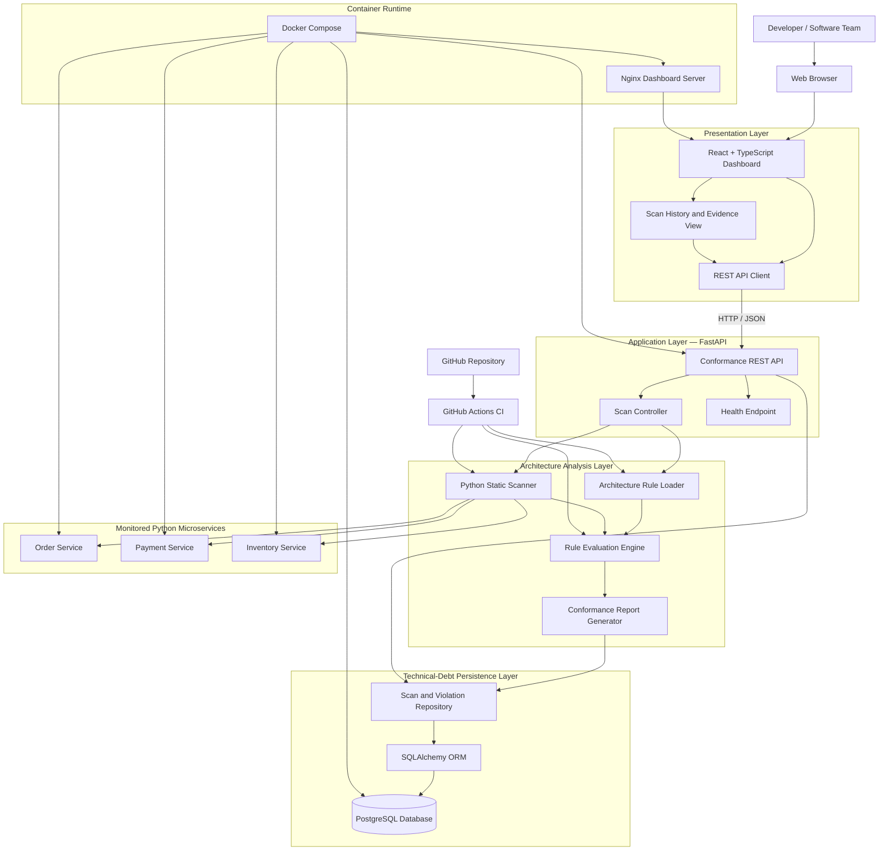
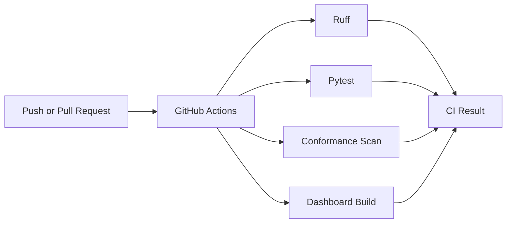
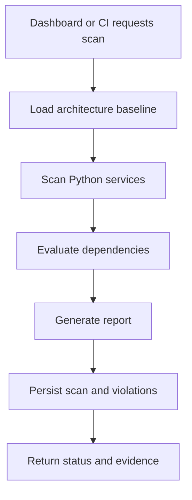

# Architecture Conformance Monitor — Component Diagram

## 1. Purpose

This document describes the major software components of the Architecture Conformance Monitor and the interactions among them.

The component diagram represents the implemented system, including:

- React and TypeScript dashboard
- FastAPI REST API
- Architecture rule loader
- Python source-code scanner
- Rule evaluation engine
- Report generator
- Technical-debt repository
- PostgreSQL database
- Sample Python microservices
- GitHub Actions CI pipeline
- Docker Compose runtime

---

## 2. System Component Diagram



---

## 3. High-Level Architecture

The system follows a layered and component-based architecture.

| Layer | Components | Responsibility |
|---|---|---|
| Presentation | React dashboard, API client, evidence panel | Presents scan results and accepts user actions |
| API | FastAPI endpoints, scan controller | Exposes system capabilities through REST |
| Analysis | Rule loader, scanner, evaluator, report generator | Detects dependencies and architecture violations |
| Persistence | Repository, SQLAlchemy, PostgreSQL | Stores scan history and violation evidence |
| Target systems | Sample Python microservices | Provide source code for architecture inspection |
| Automation | GitHub Actions | Runs quality checks and conformance scans |
| Runtime | Docker Compose and Nginx | Builds, networks and runs system components |

---

## 4. Presentation-Layer Components

### 4.1 Architecture Dashboard

The dashboard is implemented using React and TypeScript.

Its responsibilities are:

- Displaying the latest conformance status
- Showing services, files, dependencies and violation metrics
- Starting a new architecture scan
- Displaying scan trends
- Listing persisted scan history
- Opening evidence for a selected scan
- Showing detailed violation information
- Differentiating conformant and blocked scans

The dashboard communicates only with the FastAPI backend. It does not directly access PostgreSQL or scan the microservice source code.

### 4.2 REST API Client

The API client is implemented in:

```text
dashboard/src/services/api.ts
```

It encapsulates calls to the backend endpoints.

| Operation | HTTP method | Endpoint |
|---|---|---|
| Start scan | POST | `/api/v1/scans` |
| Retrieve latest scan | GET | `/api/v1/scans/latest` |
| Retrieve history | GET | `/api/v1/scans/history` |
| Retrieve scan evidence | GET | `/api/v1/scans/{scan_id}` |
| Check health | GET | `/health` |

### 4.3 Scan History and Evidence View

The scan-history component:

- Displays persisted scans in tabular form
- Highlights conformant and blocked results
- Allows the user to select an individual scan
- Retrieves the complete scan record
- Displays recorded violation evidence
- Displays a success message for scans without violations

This component provides an auditable view of architecture evolution.

---

## 5. API-Layer Components

### 5.1 Conformance REST API

The REST API is implemented using FastAPI.

Primary implementation:

```text
conformance_platform/api/main.py
```

The API acts as the boundary between the frontend and the analysis and persistence components.

Its responsibilities include:

- Validating incoming requests
- Starting architecture scans
- Returning structured JSON responses
- Persisting scan results
- Retrieving scan history
- Retrieving evidence for a particular scan
- Reporting service health
- Returning appropriate HTTP status codes

### 5.2 Scan Controller

The scan controller coordinates the complete scan workflow:

1. Load the architecture rules.
2. Inspect every configured service.
3. Extract internal Python dependencies.
4. Evaluate dependencies against the declared rules.
5. Generate a conformance report.
6. Determine whether the result is blocking.
7. Persist the scan and its violation evidence.
8. Return the result to the API client.

### 5.3 Health Endpoint

The health endpoint is exposed at:

```text
GET /health
```

It is used by:

- Docker health checks
- Developers
- Deployment environments
- Monitoring tools

It returns the API service name, version and health status.

---

## 6. Architecture Analysis Components

### 6.1 Architecture Rule Loader

The rule loader reads and validates the architecture baseline:

```text
architecture-rules/baseline.yml
```

Its responsibilities are:

- Reading the YAML rule file
- Validating the configuration with Pydantic
- Rejecting unknown fields
- Rejecting invalid service references
- Rejecting invalid database ownership
- Producing a typed architecture-rule model

The baseline defines:

- Application name
- Rules version
- Programming language
- Registered services
- Source directories
- Allowed layer dependencies
- Forbidden layer dependencies
- Shared resource restrictions

### 6.2 Python Static Scanner

The Python scanner is responsible for inspecting service source code.

Primary package:

```text
conformance_platform/scanner
```

The scanner:

- Recursively discovers Python files
- Parses source code using Python's Abstract Syntax Tree
- Identifies import statements
- Determines source and target architectural layers
- Ignores external library dependencies
- Produces dependency-evidence records
- Rejects invalid Python syntax

The scanner performs static analysis. It does not need to execute the monitored service source code.

### 6.3 Rule Evaluation Engine

The evaluation engine compares detected dependencies with the architecture baseline.

Primary package:

```text
conformance_platform/rule_engine
```

Its responsibilities are:

- Receiving validated architecture rules
- Receiving detected dependency evidence
- Checking whether each dependency is permitted
- Creating violations for forbidden dependencies
- Assigning severity and violation type
- Determining whether any violation blocks release

For example, if the baseline prohibits the `api` layer from directly importing the `repositories` layer, the evaluator produces a violation when that dependency is detected.

### 6.4 Conformance Report Generator

The report generator combines scan results and violations into a structured report.

A report contains:

- Generation timestamp
- Application name
- Rules version
- Number of services scanned
- Number of files scanned
- Number of dependencies found
- Number of violations found
- Per-service scan information
- Complete violation evidence
- Blocking status

The report can be:

- Returned through the REST API
- Written to a JSON file
- Printed by the command-line interface
- Displayed by the React dashboard
- Inspected in GitHub Actions

---

## 7. Persistence Components

### 7.1 Technical-Debt Repository

The repository provides the persistence interface used by the API.

Primary implementation:

```text
conformance_platform/debt_tracker/repository.py
```

It supports:

- Saving a scan report
- Saving associated violations
- Retrieving the latest scan
- Listing scan history
- Retrieving a scan by ID
- Loading violation evidence with a scan
- Limiting the number of returned records

The repository keeps SQLAlchemy database operations separate from the API and analysis logic.

### 7.2 SQLAlchemy ORM

SQLAlchemy maps Python domain entities to database tables.

The principal models are:

- `ScanRecord`
- `ViolationRecord`

The ORM manages:

- Table mappings
- Relationships
- Foreign keys
- Transactions
- Query construction
- Cascading deletion
- Database-session management

### 7.3 PostgreSQL Database

PostgreSQL stores the permanent technical-debt history.

It contains:

- Scan summaries
- Scan timestamps
- Application and rule versions
- Conformance status
- Violation evidence
- Source locations
- Architectural layer information

A scan may have zero or many violation records.

---

## 8. Monitored Microservice Components

The MVP includes three sample Python microservices:

| Service | Host port | Responsibility in the project |
|---|---:|---|
| Order Service | 8001 | Sample order-domain service |
| Payment Service | 8002 | Sample payment-domain service |
| Inventory Service | 8003 | Sample inventory-domain service |

These services are used as realistic scan targets.

Each service:

- Is implemented with FastAPI
- Has an application package
- Exposes a health endpoint
- Runs in an independent Docker container
- Follows the declared layered structure
- Can contain conformant or forbidden dependencies for demonstration

---

## 9. Continuous-Integration Component

GitHub Actions runs the automated quality and architecture checks.

Workflow file:

```text
.github/workflows/architecture-ci.yml
```

The CI pipeline performs:

1. Repository checkout
2. Python setup
3. Dependency installation
4. Ruff static-quality checks
5. Automated pytest execution
6. Architecture conformance scan
7. Conformance-report display
8. Dashboard dependency installation
9. Dashboard production build

The pipeline prevents code-quality or architecture failures from being silently introduced into the main branch.



---

## 10. Container and Runtime Components

### 10.1 Docker Compose

Docker Compose manages the complete local production-style environment.

It starts:

- Dashboard container
- Conformance API container
- PostgreSQL container
- Order service container
- Payment service container
- Inventory service container

It also manages:

- Container networking
- Port mappings
- Environment variables
- Service dependencies
- Health checks
- PostgreSQL persistent storage
- Image builds

### 10.2 Nginx

Nginx serves the compiled React dashboard.

Its responsibilities are:

- Serving production static assets
- Returning `index.html` for frontend routes
- Providing lightweight production web serving
- Running the dashboard independently from the Vite development server

### 10.3 Component Deployment Ports

| Component | Host port | Container port |
|---|---:|---:|
| Dashboard | 8080 | 80 |
| Conformance API | 8000 | 8000 |
| Order Service | 8001 | 8000 |
| Payment Service | 8002 | 8000 |
| Inventory Service | 8003 | 8000 |
| PostgreSQL | 5432 | 5432 |

---

## 11. Component Communication

| Source | Target | Interface | Data |
|---|---|---|---|
| Browser | Dashboard | HTTP | HTML, CSS and JavaScript |
| Dashboard | Conformance API | REST/JSON | Scan requests and responses |
| API | Rule loader | Python interface | Architecture-rule path |
| API | Scanner | Python interface | Service names and source paths |
| Scanner | Microservice source | File-system access | Python source files |
| Evaluator | Report generator | Python models | Dependencies and violations |
| API | Repository | Python interface | Scan and violation records |
| Repository | PostgreSQL | SQLAlchemy/SQL | Persistent data |
| GitHub Actions | CLI | Shell command | Automated scan request |
| Docker Compose | Containers | Docker network | Service lifecycle and networking |

---

## 12. Scan Execution Flow



---

## 13. Conformant Scan Flow

A conformant scan follows this path:

1. The user selects **Run scan**.
2. The dashboard calls `POST /api/v1/scans`.
3. The API invokes the scan workflow.
4. The scanner inspects the registered services.
5. The evaluator finds no forbidden dependency.
6. The report contains zero violations.
7. A scan record is saved without violation children.
8. The API returns `blocking: false`.
9. The dashboard displays **Conformant**.
10. The evidence panel displays **No violations recorded**.

---

## 14. Blocked Scan Flow

A blocked scan follows this path:

1. A forbidden dependency exists in a monitored service.
2. The user or CI starts a scan.
3. The scanner detects the dependency.
4. The evaluator compares it with the baseline.
5. A blocking violation is generated.
6. The scan and violation evidence are saved.
7. The API returns `blocking: true`.
8. The dashboard displays **Release blocked**.
9. The history table marks the scan as **Blocked**.
10. The evidence panel displays the service, source file, line, layers, target module, severity and violation ID.

---

## 15. Component Dependency Rules

The platform itself follows these dependency principles:

- The dashboard depends on the REST API, not directly on the database.
- The API coordinates components but does not implement scanning logic.
- The scanner discovers dependencies but does not decide whether they are valid.
- The evaluator decides conformance using validated rules.
- The repository manages persistence but does not perform architecture analysis.
- The PostgreSQL component does not depend on application components.
- GitHub Actions calls public development interfaces rather than internal database operations.
- Docker Compose manages runtime dependencies without containing business logic.

These boundaries reduce coupling and keep each component independently testable.

---

## 16. Component-to-Requirement Traceability

| Component | Primary requirements satisfied |
|---|---|
| Dashboard | Scan execution, visualization, history and evidence |
| REST API | Programmatic access and request coordination |
| Rule loader | Architecture-baseline validation |
| Python scanner | Static dependency discovery |
| Evaluation engine | Violation detection and release blocking |
| Report generator | Structured and auditable output |
| Repository | Scan and evidence persistence |
| PostgreSQL | Durable technical-debt history |
| GitHub Actions | Continuous automated enforcement |
| Docker Compose | Reproducible deployment |
| Nginx | Production dashboard serving |

---

## 17. Component Testing

Each major component is covered by an appropriate verification strategy.

| Component | Verification method |
|---|---|
| Rule loader | Unit tests for valid and invalid rule files |
| Python scanner | Unit tests for imports and invalid syntax |
| Evaluation engine | Unit tests for forbidden dependencies |
| Repository | In-memory database tests |
| REST API | FastAPI client integration tests |
| Dashboard | TypeScript compilation and production build |
| Complete backend | Pytest suite |
| Source quality | Ruff |
| CI workflow | GitHub Actions execution |
| Container system | Docker Compose health checks |
| Evidence view | Manual conformant and blocked scan verification |

---

## 18. Security and Reliability Considerations

The component architecture supports reliability through:

- Strict Pydantic validation
- Explicit REST response models
- Database transaction handling
- Foreign-key relationships
- Container health checks
- CI quality gates
- Static analysis without executing target application code
- Separation of presentation, analysis and persistence responsibilities
- Environment-based database configuration
- Reproducible Docker builds

For the academic MVP, authentication and role-based authorization are outside the current scope and can be added in a future version.

---

## 19. Benefits of the Component Architecture

The component-based design provides:

- Clear separation of concerns
- Independent component testing
- Replaceable persistence and presentation technologies
- Reduced coupling
- Easier maintenance
- Reusable analysis logic
- Support for CLI, REST and CI execution
- Auditable technical-debt history
- Reproducible deployment
- Future extensibility for other programming languages and rule types

---

## 20. Conclusion

The Architecture Conformance Monitor is divided into presentation, API, analysis, persistence, target-service, automation and runtime components.

The React dashboard allows developers to run and inspect scans. The FastAPI backend coordinates the architecture-analysis workflow. The scanner extracts Python dependencies, the evaluation engine detects forbidden relationships, and the repository stores scan and violation evidence in PostgreSQL. GitHub Actions provides continuous enforcement, while Docker Compose supplies a reproducible runtime environment.

This component structure enables the system to continuously identify architecture drift, preserve technical-debt evidence and prevent blocking violations from being overlooked.